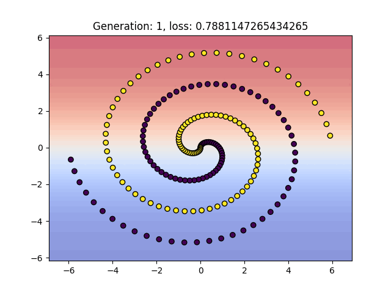

# neat
neuroevolution of augmenting topologies implementation

  

a quick and messy JAX implementation of NEAT (Stanley, K. O. and Miikkulainen, R. 2002).

based on TensorNEAT (Lishuang Wang, Mengfei Zhao, Enyu Liu, Kebin Sun, & Ran Cheng. (2024). Tensorized NeuroEvolution of Augmenting Topologies for GPU Acceleration.) but more faithful to the original paper.

also includes example code to use with backpropagation (like https://blog.otoro.net/2016/05/07/backprop-neat/), to search for efficient architectures.

  
  

i wrote this for self educational purposes. crossover, speciation, and mutations currently does not really take advantage of JAX operations, making them the bottleneck. there are probably some bad practices in here, especially with JAX stuff. i am a noob. feed forward / network inference is pretty fast though.

in the future, i would like to rewrite this properly and design it to interface nicely with something like EvoJAX.
